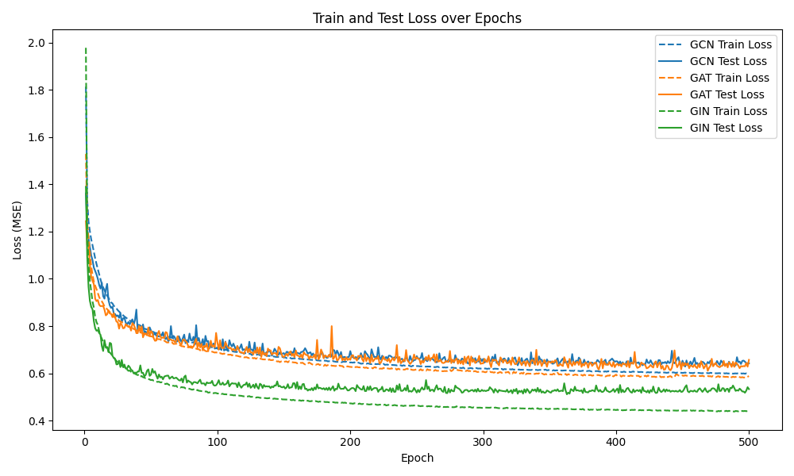

# Molecular Engineering with GNNs – Model Comparison using QM9 and Neptune

## Overview
This project demonstrates a molecular engineering application using Graph Neural Networks (GNNs) on the QM9 dataset. Three state-of-the-art GNN architectures are compared:
- **GCN (Graph Convolutional Network)**
- **GAT (Graph Attention Network)**
- **GIN (Graph Isomorphism Network)**

Each model is trained to predict the internal energy at 0K (U₀) in a regression setting. Additionally, all key hyperparameters, training losses, evaluation metrics, model summaries, and plots are tracked using Neptune.

### Loss Curves Visualization
The image below shows the training loss curves for each model, providing a quick overview of their performance during training.



## Development Environment
This project is configured as a devcontainer so that you can open it in Visual Studio Code (or another compatible editor) with a reproducible environment. The devcontainer uses a GPU-ready PyTorch base image:
**pytorch/pytorch:2.0.0-cuda11.7-cudnn8-runtime**

The NEPTUNE_API_TOKEN is copied from your local environment into the container automatically.

## How to Use
1. **Set your Neptune API Token:**
   - Ensure you have your Neptune API token set in your local environment as `NEPTUNE_API_TOKEN`.

2. **Open in a Dev Container:**
   - Install the [Remote - Containers extension](https://marketplace.visualstudio.com/items?itemName=ms-vscode-remote.remote-containers) for VS Code.
   - Reopen the project folder in a container (via the Command Palette: "Remote-Containers: Reopen in Container").

3. **Run the Model Comparison:**
   Once inside the container, run:
   ```bash
   python gnn_compare.py
   ```
   This script will download the QM9 dataset (if not already cached), train the three models for 10 epochs each, and log all key metrics and the comparison plot (`comparison_loss.png`) to Neptune.

## Dependencies
The project relies on:
- PyTorch and PyTorch Geometric (for GNNs)
- Matplotlib (for plotting)
- Neptune (for experiment tracking)

All dependencies are listed in `requirements.txt` and are installed automatically in the devcontainer.

## Dataset Note
The QM9 dataset is automatically downloaded by PyTorch Geometric and cached under the `data/QM9` folder. For this demo, a random subset of 5,000 molecules is used to speed up training.

## References
- [QM9 Dataset](https://deepchemdata.s3-us-west-1.amazonaws.com/datasets/gdb9.tar.gz)
- Fey, M., & Lenssen, J. E. (2019). Fast Graph Representation Learning with PyTorch Geometric. [arXiv:1903.02428](https://arxiv.org/abs/1903.02428)

## License
This project is licensed under the MIT License. See the [LICENSE](LICENSE) file for details.
