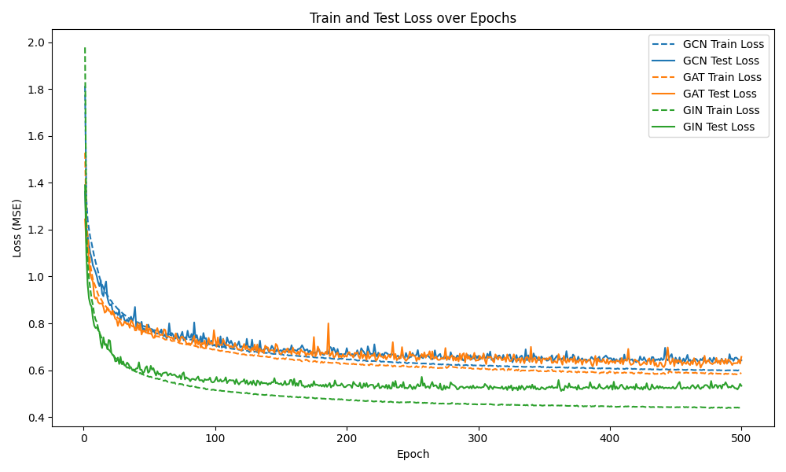

# Molecular-GNN-Explorer

> Benchmark six GNN architectures on molecular property prediction using the QM9 dataset — fully reproducible via devcontainer.



## What This Is

Molecular-GNN-Explorer trains and compares six Graph Neural Network architectures on a regression task: predicting the internal energy at 0 K (U₀) of small organic molecules from the [QM9 dataset](https://deepchemdata.s3-us-west-1.amazonaws.com/datasets/gdb9.tar.gz). All runs are tracked automatically with [Neptune](https://app.neptune.ai/happyproject235/Molecular-GNN-Explorer/runs).

### Models

| Model | Reference |
|---|---|
| **GCN** – Graph Convolutional Network | Kipf & Welling, 2017 |
| **GAT** – Graph Attention Network | Veličković et al., 2018 |
| **GIN** – Graph Isomorphism Network | Xu et al., 2019 |
| **PAMNet** – Universal geometric deep learning framework | [Zhang et al., 2023](https://paperswithcode.com/paper/a-universal-framework-for-accurate-and-1) |
| **MXMNet** – Multiplex molecular mechanics GNN | [Zhang et al., 2020](https://paperswithcode.com/paper/molecular-mechanics-driven-graph-neural) |
| **ComENet** – Complete & efficient 3D message passing | [Wang et al., 2022](https://paperswithcode.com/paper/comenet-towards-complete-and-efficient) |

> **Note:** PAMNet, MXMNet, and ComENet are implemented as simplified versions. ComENet is computationally heavy — it computes distance, polar angle, azimuth, and rotation angle for every edge in the 1-hop neighborhood, which substantially increases training time on large datasets.

## Quickstart

### Prerequisites
- [Docker](https://www.docker.com/)
- [VS Code](https://code.visualstudio.com/) with the [Dev Containers extension](https://marketplace.visualstudio.com/items?itemName=ms-vscode-remote.remote-containers)
- A [Neptune](https://neptune.ai/) account and API token

### Setup

1. **Set your Neptune API token** in your local shell environment:
   ```bash
   export NEPTUNE_API_TOKEN="your_token_here"
   ```
   The devcontainer picks this up automatically.

2. **Open in Dev Container:**
   - Open the project folder in VS Code.
   - Run `Remote-Containers: Reopen in Container` from the Command Palette.
   - The container is based on `pytorch/pytorch:2.0.0-cuda11.7-cudnn8-runtime` and installs all dependencies from `requirements.txt` automatically.

3. **Run the benchmark:**
   ```bash
   python gnn_compare.py
   ```
   This downloads QM9 (cached under `data/QM9`), trains all models, and logs metrics, loss curves, and model summaries to Neptune.

> To speed up iteration, you can reduce dataset size by uncommenting the `shuffle[:N]` lines in `gnn_compare.py`.

## Experiment Tracking

All completed experiments are available on the Neptune dashboard:
**[View runs →](https://app.neptune.ai/happyproject235/Molecular-GNN-Explorer/runs)**

Neptune logs per run:
- Hyperparameters
- Training and validation loss curves
- Evaluation metrics (MAE, RMSE)
- Model architecture summaries

## Dependencies

| Package | Purpose |
|---|---|
| `torch` + `torch-geometric` | GNN models and data loading |
| `matplotlib` | Loss curve plots |
| `neptune` | Experiment tracking |

All packages are pinned in `requirements.txt` and installed automatically inside the devcontainer.

## References

- Fey, M., & Lenssen, J. E. (2019). *Fast Graph Representation Learning with PyTorch Geometric.* [arXiv:1903.02428](https://arxiv.org/abs/1903.02428)
- Zhang et al. (2023). *PAMNet: A Universal Framework for Accurate and Efficient Geometric Deep Learning of Molecular Systems.* [paperswithcode](https://paperswithcode.com/paper/a-universal-framework-for-accurate-and-1)
- Zhang et al. (2020). *MXMNet: Molecular Mechanics-Driven Graph Neural Network with Multiplex Graph for Molecular Structures.* [paperswithcode](https://paperswithcode.com/paper/molecular-mechanics-driven-graph-neural)
- Wang et al. (2022). *ComENet: Towards Complete and Efficient Message Passing for 3D Molecular Graphs.* [paperswithcode](https://paperswithcode.com/paper/comenet-towards-complete-and-efficient)

## License

MIT — see [LICENSE](LICENSE).
